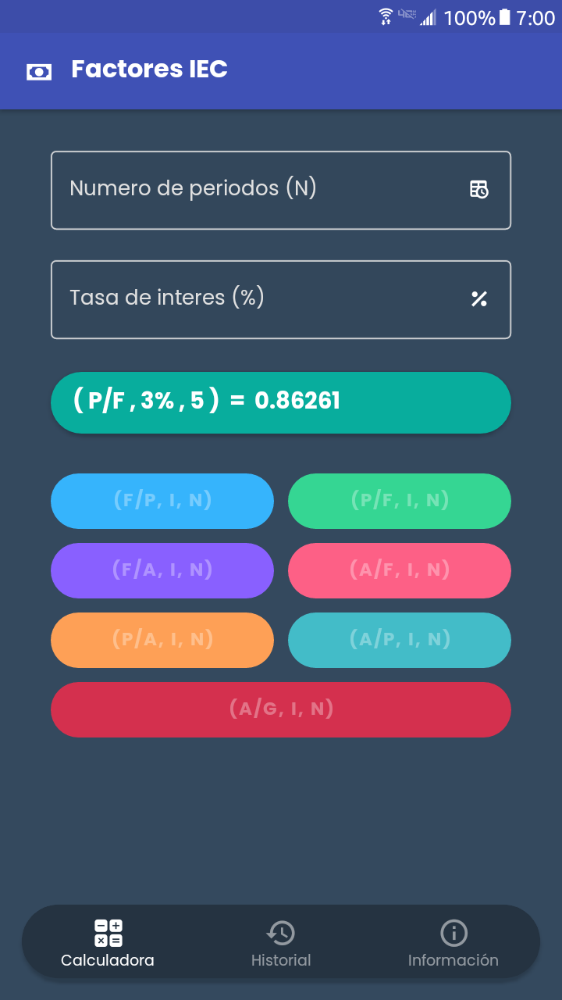

# Factores IEC

Factores IEC React Native

  
  

## Descargar

- [Android - Descargar Apk](https://github.com/leonelhenriquez/factores-iec-react-native/releases/download/v1.0.1/FactoresIEC_Android-universal.apk)

- [Android - Descargar Apk - arm64-v8a](https://github.com/leonelhenriquez/factores-iec-react-native/releases/download/v1.0.1/FactoresIEC_Android-arm64-v8a.apk)

- [Android - Descargar Apk - armeabi-v7a](https://github.com/leonelhenriquez/factores-iec-react-native/releases/download/v1.0.1/FactoresIEC_Android-armeabi-v7a.apk)

- [Android - Descargar Apk - x86_64 ](https://github.com/leonelhenriquez/factores-iec-react-native/releases/download/v1.0.1/FactoresIEC_Android-x86_64.apk)

- [Android - Descargar Apk - x86](https://github.com/leonelhenriquez/factores-iec-react-native/releases/download/v1.0.1/FactoresIEC_Android-x86.apk)

## Licencia

[GNU General Public License v3.0](LICENSE)

